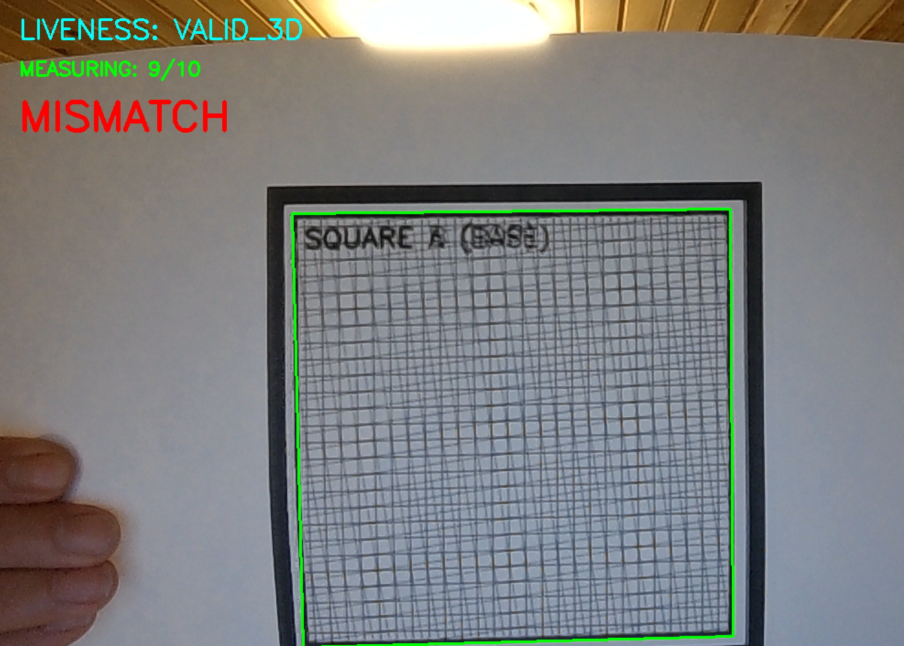

# PBM 2D Bypass Test

This guide describes how to verify the **PBM Liveness Detection** by attempting to bypass the system with a 2D image.

## Setup

1.  **Image**: Use the provided spoofing target: `assets/test_2d_bypass.png`.
2.  **Display**:
    - **Print**: Print the image (scale 100%) on a single sheet of A4 paper.
    - **Digital**: Alternatively, display it on a high-resolution tablet or monitor.

## Test Procedure

1.  Run the verification or enrollment tool:
    ```powershell
    python pbm_mvp/verify.py
    # OR
    python pbm_mvp/enroll.py
    ```
2.  **Presentation**: Show the 2D image/screen to the camera.
3.  **Action**: When prompted to **"MOVE CAMERA SLIGHTLY"**, perform the usual parallel movement.

### Visual Example

*Showing a 2D image to the camera results in INVALID_2D because there is no parallax (relative motion) between the layers.*

## Expected Result

> [!IMPORTANT]
> **FAIL**: The system should NOT accept this target.

- **Status**: Should display `INVALID_2D`.
- **Reason**: Since there is no physical gap between layers, no parallax (relative motion) is detected. The PBM algorithm correctly identifies this as a flat spoof.

---
*This test proves that PBM prevents identity theft via photocopies or digital screen replays.*
