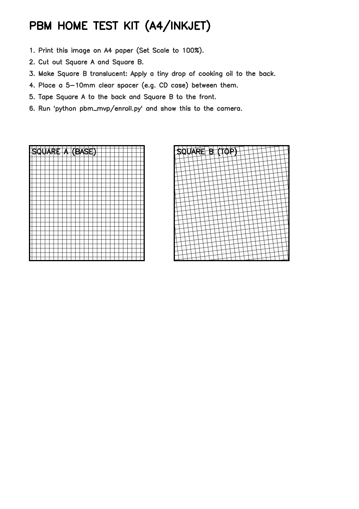

# PBM Home Testing Guide

This guide describes how to test the **Parallax-Bit Mapping (PBM)** authentication protocol using standard A4 paper and an inkjet printer.

## Prerequisites

- Inkjet or Laser printer.
- Standard A4 paper.
- A transparent spacer: A clear CD jewel case, 5-10mm of acrylic, or a piece of thick transparent plastic.
- Tape or adhesive.
- **Translucency Agent**: A tiny amount of cooking oil or mineral oil.
- Python environment with dependencies installed (`opencv-python`, `numpy`, `cryptography`).

## Step 1: Generate the printable Kit

Produce the required high-frequency grids and assembly guide by running the kit generator:

```powershell
.venv\Scripts\python assets/home_test_kit.py
```

This creates `assets/test_kit_a4.png`.



## Step 2: Physical Assembly

1.  **Print**: Open `assets/test_kit_a4.png` and print it at **100% scale** (Disable "Scale to Fit").
2.  **Cut**: Cut out the two patterns labeled **SQUARE A** and **SQUARE B**.
3.  **Translucency Hack**: Apply a small drop of cooking oil to the back of **SQUARE B** (the Top Layer) and wipe off the excess. This makes the paper fibers transparent enough for the camera to see the underlying layer.
4.  **Layering**:
    - Tape **SQUARE A** to the back side of your transparent spacer.
    - Tape **SQUARE B** to the front side.
    - Result: You now have two high-frequency grids separated by a ~5-10mm physical gap.

## Step 3: Enrollment (Manufacturing)

Register your physical token into the digital system:

```powershell
.venv\Scripts\python pbm_mvp/enroll.py
```

1.  Align the token with the on-screen box.
2.  Move the camera slightly when prompted. The system is measuring the **Parallax Field** created by the gap between Layer A and B.
3.  The tool will output a signed JSON block. **Copy this JSON.**

## Step 4: Verification (User Check)

Validate the authenticity of your physical token:

```powershell
.venv\Scripts\python pbm_mvp/verify.py
```

1.  Present the token to the camera.
2.  The tool checks for **3D Liveness** (to ensure it's not a photocopy) and compares the measured physical fingerprint against the digital signature.

---
> [!TIP]
> **Troubleshooting**: If liveness fails, ensure you are in a well-lit area and the oil has made Square B sufficiently translucent for the grid on Square A to be visible to the camera.
