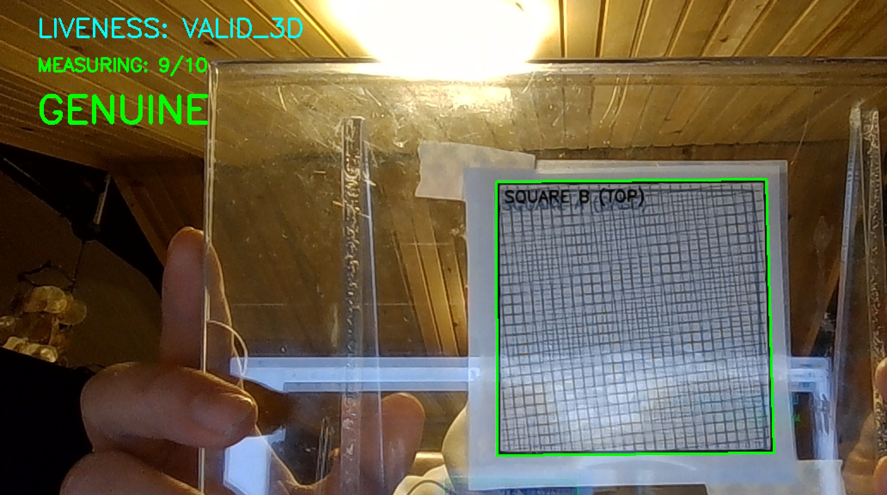

# PBM Home Testing Guide

This guide describes how to test the **Parallax-Bit Mapping (PBM)** authentication protocol using standard A4 paper and an inkjet printer.

## Prerequisites

- Inkjet or Laser printer.
- Standard A4 paper.
- A transparent spacer: A clear CD jewel case, 5-10mm of acrylic, or a piece of thick transparent plastic.
- Tape or adhesive.
- **Top Layer Material**: Inkjet-compatible semi-transparent plastic sticker (Recommended) or standard A4 paper with a translucency agent (cooking/mineral oil).
- Python environment with dependencies installed (`opencv-python`, `numpy`, `cryptography`).

## Step 1: Generate the printable Kit

Produce the required high-frequency grids and assembly guide by running the kit generator:

```powershell
python pbm_mvp/assets/home_test_kit.py
```

This creates `/assets/test_kit_a4.png`.


## Step 2: Physical Assembly

1.  **Print**: Open `pbm_mvp/assets/test_kit_a4.png` and print it at **100% scale** (Disable "Scale to Fit").
2.  **Cut**: Cut out the two patterns labeled **SQUARE A** and **SQUARE B**.
3.  **Translucency**: For optimal results, using an **inkjet-compatible semi-transparent plastic sticker** for the top layer is highly recommended. If this is not available, you can use the "Oil Hack" below (note that standard paper with oil or other alternatives often fail to provide sufficient clarity and are generally not recommended):
    - Apply a small drop of cooking oil to the back of **SQUARE B** (the Top Layer) and wipe off the excess. This makes the paper fibers transparent enough for the camera to see the underlying layer.
4.  **Layering**:
    - Tape **SQUARE A** to the back side of your transparent spacer.
    - Tape **SQUARE B** to the front side.
    - Result: You now have two high-frequency grids separated by a ~5-10mm physical gap.

### Visual Guide
To understand what we are emulating, here is an example of a real PBM-protected product and the measurement process:

| Real Product Example | Measurement Alignment |
| :---: | :---: |
|  |  |
| *High-frequency patterns on a real product* | *Camera view during liveness check* |

## Step 3: Enrollment (Manufacturing)

Register your physical token into the digital system:

```powershell
.venv\Scripts\python pbm_mvp/enroll.py
```

1.  Align the token with the on-screen box.
2.  Move the camera slightly when prompted. The system is measuring the **Parallax Field** created by the gap between Layer A and B.
3.  The tool will output a signed JSON block. **Copy this JSON.**

## Step 4: Verification (User Check)

Validate the authenticity of your physical token:

```powershell
.venv\Scripts\python pbm_mvp/verify.py
```

1.  **QR Scanning**: Scan the QR code containing the digital signature.
    
2.  **Liveness Check**: Present the token to the camera.
3.  The tool checks for **3D Liveness** (to ensure it's not a photocopy) and compares the measured physical fingerprint against the digital signature.

---
> **Troubleshooting**: If liveness or registration fails, ensure you are using a **semi-transparent sticker** as recommended. If using the oil hack, ensure the area is well-lit and the paper is sufficiently translucent for the underlying grid on Square A to be clearly visible to the camera. Most "home-made" alternatives have high failure rates due to light scattering.

